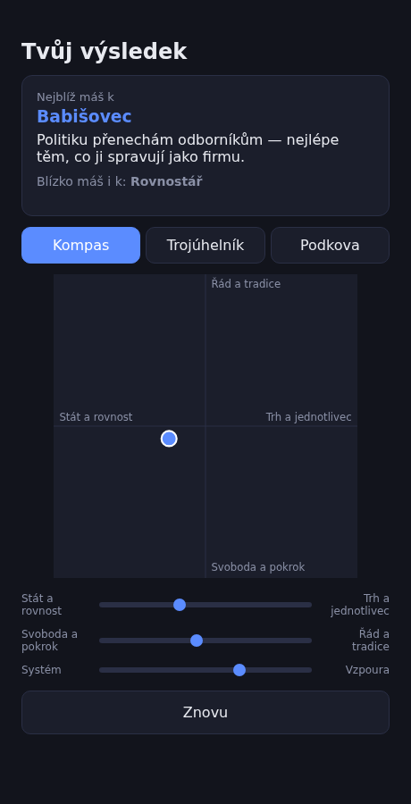
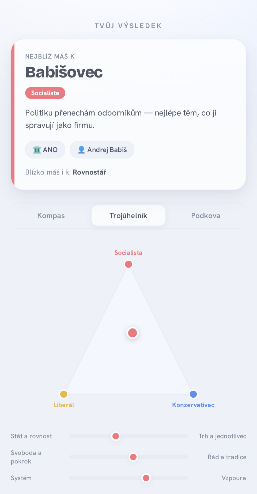

# Kompas — a data-driven political compass

A tiny static web app: answer 20 simple statements and it places you on a
political map. The twist over a classic compass — you can flip the **same
result** between three lenses: a 2-axis **compass**, a
liberal/conservative/socialist **triangle**, and a **horseshoe** ("podkova").
It names the party you land closest to **and the closest politician within that
party** — shown with a round Wikimedia photo and a short bio — and plots every
party as an avatar on the compass so you can see where you sit among them. The
compass corners are colour-coded the classic way (authoritarian-left red,
libertarian-left green, authoritarian-right blue, libertarian-right amber).

Seven domains ship today, each domain-specific and in its own language: Czech 🇨🇿,
Polish 🇵🇱, the EU 🇪🇺 (English), the USA 🇺🇸 (English), the UK 🇬🇧 (English),
Ukraine 🇺🇦 (Ukrainian) and France 🇫🇷 (French). Party and politician positions are
calibrated from the Chapel Hill Expert Survey and DW-NOMINATE (see the docs). Each
party carries three real politicians; the quiz picks the best-matching one.
Every domain is just one JSON file — adding one is a data task, not a code change.

**A game, not sociology.**

**Live demo:** https://adamek727.github.io/kompas/

| Home | Result — persona | Triangle |
|------|------------------|----------|
|  |  |  |

## How it works

Answers score three axes, each in `[-1, +1]`:

- **economic** — state & equality ↔ market & individual
- **social** — freedom & progress ↔ order & tradition
- **system** — trust the establishment ↔ anti-establishment / populist

All three visualizations are projections of that same 3-vector, and each
persona is a point in the same space — your match is simply the nearest one.
One scoring pass, three pictures. The horseshoe additionally uses the `system`
axis to push radical profiles toward the tips.

## Run

    python3 -m http.server 8000
    # open http://localhost:8000

No build step, no dependencies.

## Test

    node --test

The scoring engine, the three SVG views, the HTML builders and the result
screen are covered by pure unit tests; data packs are validated automatically.

## Add a domain

1. Copy `data/cz.json` to `data/<id>.json`. Translate `ui`, `scale`, `axes`;
   write 20 `questions` (each `weights` key must be a declared axis) and ≥8
   `personas` (a numeric `coords` for every axis, a `party`, and 3 `politicians`
   each with `name`/`photo`/`bio`/`coords`); set the three `views` (give each
   triangle pole a `color`).
2. Add `{ id, flag, name, enabled: true }` to `DOMAINS` in `js/app.js`.
3. `node --test` — the pack test validates every `data/*.json` (structure,
   ≥30 questions, ≥8 personas).

## Project layout

    index.html            single page; mounts #app
    css/styles.css         all styling
    js/scoring.js          pure engine: scoring, matching, projections, validation
    js/views/*.js          compass / triangle / horseshoe → SVG strings
    js/render.js           home + quiz HTML builders
    js/result.js           result screen + view switcher
    js/app.js              state machine + DOM wiring
    data/*.json            one self-describing, localized pack per country
    test/*.test.js         node --test suite
    docs/                  design spec, implementation plan, assets

Design and implementation notes live in `docs/superpowers/`.

## Docs

- [Architecture](docs/architecture.md) — how the system works.
- [Development](docs/development.md) — how it was built.
- [Security](docs/security.md) — the basic defense wall.
- [Stats collector](docs/stats-collector.md) — optional, opt-in session collection.

## Credits

Politician photos are hotlinked thumbnails from **Wikimedia Commons** (various
free licences, mostly CC BY-SA / public domain), resolved per person via the
Wikipedia REST API. They are used illustratively for a non-commercial game; if a
thumbnail is missing or fails to load, the UI falls back to coloured initials.

## License

MIT — see [LICENSE](LICENSE). The bundled code and question/persona text are
MIT; linked photos remain under their respective Wikimedia licences.
